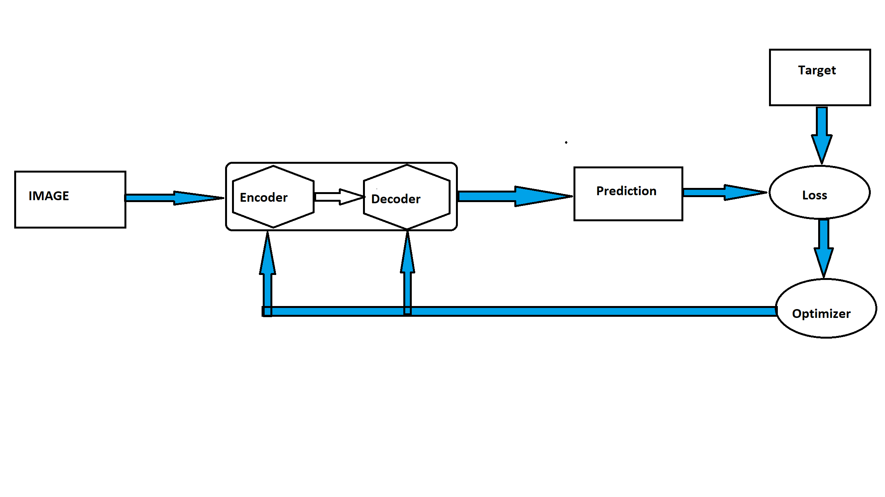
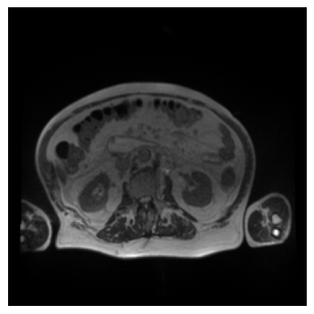
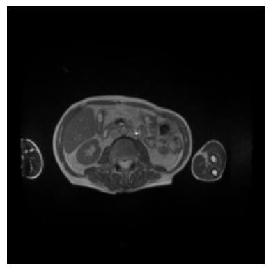
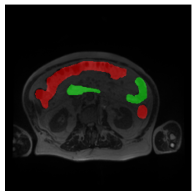
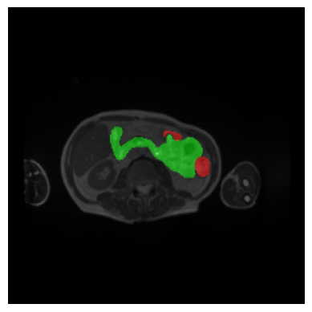
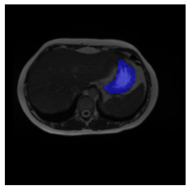

  
  <h1 align="center">Medical Image Segmentation</h1>

This repository has been created to delve into the realm of AI within the field of medicine. Our goal is to devise and execute a straightforward but precise initiative in this domain. I express my gratitude to Howsam Academy and Dr. Seyed Sajad Ashrafi for their assistance during challenging situations.

## 1. Problem Statement

This segment focuses on a prevalent form of cancer in the population and an effective deep-learning approach to aid in its treatment. However, before delving into that, we aim to provide a concise definition of semantic segmentation and its related concepts.
   1-Image segmentation: Image segmentation involves dividing an image into meaningful segments or regions based on certain characteristics, such as color, intensity, texture, or boundaries.
   2- Semantic segmentation: the algorithm attempts to label every single pixel.
    In medicine, segmenting can out the image exactly which pixels correspond to certain parts of the patient's anatomy

In summary, medical image segmentation is a critical component of modern healthcare, offering improvements in diagnosis, treatment planning, research, and education. 

  ### Main objective:

To perform segmentation on the stomach and intestines, aiming to support oncologists in the precise administration of X-ray treatments. the ultimate goal is to reduce patient's pain levels and enhance the overall effectiveness of medical interventions

## 2. Related Works
This section presents both common and innovative methods and architectures, aiming to provide readers with a comprehensive understanding of the subject. 

| Number | Architecture | Short Description | Link |
|--------|--------------|-------------------|------|
| 1   |   OneFormer    | new panoptic architectures used the same architecture to achieve top performance across different tasks. a unique multi-task universal architecture with a task-conditioned joint training strategy that sets new state-of-the-art across semantic | [Link](https://paperswithcode.com/paper/oneformer-one-transformer-to-rule-universal) |
| 2      |   UNet++    | A deeply-supervised encoder-decoder network where the encoder and decoder sub-networks are connected through a series of nested, dense skip pathways. The re-designed skip pathways aim at reducing the semantic gap between the feature maps of the encoder and decoder sub-networks  |[Link](https://paperswithcode.com/paper/unet-a-nested-u-net-architecture-for-medical) |
| 3     |  Deeplabv3     |designed modules that employ atrous convolution in cascade or in parallel to capture multi-scale context by adopting multiple atrous rates  |[Link](https://paperswithcode.com/method/deeplabv3) |
|4       |    BiSeNet          |designed a Spatial Path with a small stride to preserve the spatial information and generate high-resolution features. Meanwhile, a Context Path with a fast downsampling strategy is employed to obtain a sufficient receptive field. | [Link](https://paperswithcode.com/paper/bisenet-bilateral-segmentation-network-for)  |
| 5      |  U-Net      |The architecture consists of a contracting path to capture context and a symmetric expanding path that enables precise localization  |[Link](https://paperswithcode.com/paper/u-net-convolutional-networks-for-biomedical) |
| 6      |  SegFormer      |The proposed SegFormer framework consists of two main modules: A hierarchical Transformer encoder to extract coarse and fine features; and a lightweight All-MLP decoder to directly fuse these multi-level features and predict the semantic segmentation mask. “FFN” indicates feed-forward network  |[Link](https://arxiv.org/abs/2105.15203v3)|

 

## 3. The Proposed Method
### U-Net : 
U-Net is a convolutional neural network (CNN) architecture designed for semantic segmentation tasks in image processing. It consists of an encoder and decoder
  **1-Encoder** : 
 downsampling is employed, involving both the increasing number of channel dimensions and the utilization of Max pooling to effectively reduce the height and width
  **2-Decoder**:the dimensions of height and width are increased while simultaneously decreasing the number of channels

    

### proposed block diagram :
 

  

      
  

  
Output: Considering channels based on the number of classes we have, and if it involves binary segmentation, incorporating one channel for foreground and background. Additionally, for multiple segmentations, setting an equal number of channels

Target: Either one-hot encoding or label encoding can be employed.

### Loss Function : 

| Loss Function                | Description                                           
|------------------------------|-------------------------------------------------------
| Binary Cross-Entropy (BCE)    | specifically designed for binary classification problems where there are only two classes (commonly denoted as 0 and 1). 
| Dice Loss (Dice)              | It measures the similarity or overlap between the predicted segmentation and ground truth masks.Dice Loss = 1 - (2 * Σ(p_i * g_i)) / (Σ(p_i^2) + Σ(g_i^2)) 
| Jaccard Loss (Jaccard)        | It quantifies the similarity between the predicted segmentation mask and the ground truth mask. 
| Tversky Loss (Tversky)        | The Tversky Loss is a modification of the Dice Loss, introducing adjustable weightings for false positives and false negatives. 

### Evaluation Metric :
there are some useful and common evaluation metric 
| Evaluation               | Description                                           |Formula 
|--------------------------|-------------------------------------------------------|---------
| Accuracy   | Accuracy is the ratio of correctly predicted instances to the total instances |Accuracy= Total Instances /True Positives+True Negatives
| Dice Loss (Dice)              | It measures the similarity or overlap between the predicted segmentation and ground truth masks.Dice Loss = 1 - (2 * Σ(p_i * g_i)) / (Σ(p_i^2) + Σ(g_i^2)) 
| Jaccard Loss (Jaccard)        | It quantifies the similarity between the predicted segmentation mask and the ground truth mask. 
| Tversky Loss (Tversky)        | The Tversky Loss is a modification of the Dice Loss, introducing adjustable weightings for false positives and false negatives.

## 4. Implementation
This section delves into the practical aspects of the project's implementation.

### 4.1. Dataset
<blockquote>
  <h4>4.1.1. Data Overview:</h4>
  
This dataset encompasses a cases folder that includes samples in 16-bit grayscale PNG format. Additionally, it includes a CSV file named <code>train.csv</code> featuring 115,488 rows and three classes: <strong>large_bowel</strong>,    <strong>small_bowel</strong>, and <strong>stomach</strong>. Some cases in the dataset also provide segmentation information.

   <h4>4.1.2. Dataset preparation:</h4>
    analyzing and refining the train.csv dataset to provide a comprehensive understanding of the data.
      1-Begin by using Pandas to read the segmentation column from the <strong>train.csv</strong>file.
    
We should use the RLE (Run-Length Encoding) method for the segmentation column and generate the RLE_MASK.

</blockquote>

  ## Row 1

| Large Bowel        | Small Bowel         | Stomach             |
| :-----------------: | :-----------------: | :-----------------: |
|  |  |  |

## Row 2

|  Mask   |  Mask    |  Mask        |
| :-----------------: | :-----------------: | :-----------------: |
|  |  |  |

  
Under this subsection, you'll find information about the dataset used for the medical image segmentation task. It includes details about the dataset source, size, composition, preprocessing, and loading applied to it.
[Dataset](https://drive.google.com/file/d/1-2ggesSU3agSBKpH-9siKyyCYfbo3Ixm/view?usp=sharing)

### 4.2. Model
In this subsection, the architecture and specifics of the deep learning model employed for the segmentation task are presented. It describes the model's layers, components, libraries, and any modifications made to it.

### 4.3. Configurations
This part outlines the configuration settings used for training and evaluation. It includes information on hyperparameters, optimization algorithms, loss function, metric, and any other settings that are crucial to the model's performance.

### 4.4. Train
Here, you'll find instructions and code related to the training of the segmentation model. This section covers the process of training the model on the provided dataset.
